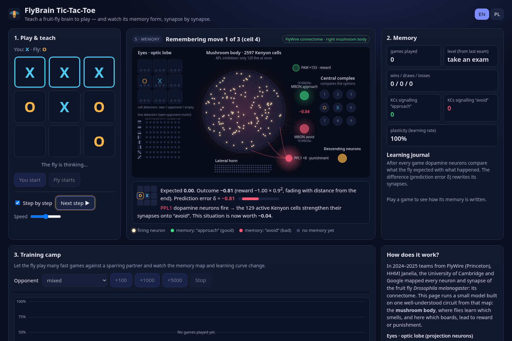
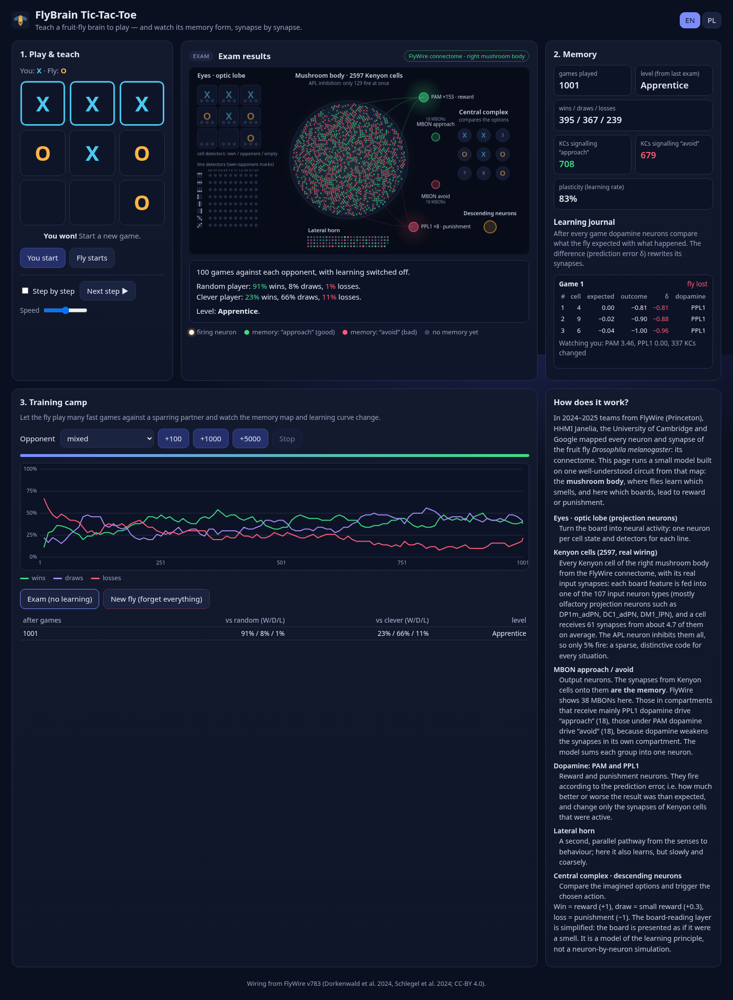

# FlyBrain Tic-Tac-Toe

A web app where anyone can teach a model of the fruit-fly brain to play
tic-tac-toe, and watch how its memory is built step by step.

The fly's learning centre is wired with **real connectome data**: all 2,597
Kenyon cells of the right mushroom body from the FlyWire wiring diagram of an
adult fruit-fly brain, with their real input synapses, output neurons and
dopamine compartments.

Each visitor gets their own fly, which starts with no memories at all. It
learns only from rewards and punishments. A win releases "reward" dopamine,
a loss releases "punishment" dopamine, and these signals rewrite the synapses
of the mushroom body, the fly's learning centre. The page animates every step:

1. **Perception**: the board activates sensory (projection) neurons.
2. **Imagination**: for every possible move the fly pictures the resulting
   board. A sparse set of Kenyon cells fires and recalls how good that
   situation was in the past.
3. **Decision**: the central complex compares the options, and descending
   neurons trigger the chosen move.
4. **Outcome**: at the end of the game dopamine neurons fire. PAM neurons
   signal reward, PPL1 neurons signal punishment.
5. **Memory**: the fly replays each of its moves and compares the expected
   value with the actual outcome. The prediction error δ decides which
   synapses are strengthened and which are weakened.
6. **Observation**: the fly also learns from the opponent's moves.
7. **Consolidation**: the memory map shows the updated synapses, and the
   learning journal records the game.

A training camp lets the fly play thousands of fast games against a sparring
partner. You can watch the learning curve and the memory map change, then
take an exam (100 games with learning switched off) to measure progress. The
interface is available in English and Polish.





## Quick start

Requirements: Python 3.10 or newer.

```bash
git clone https://github.com/GrzegorzOle/flybrain-tictactoe.git
cd flybrain-tictactoe
python3 -m venv .venv
. .venv/bin/activate
pip install -r requirements.txt
python server.py
```

Then open <http://127.0.0.1:8000>.

## Running on a server

The app is a small Flask application with no build step. Use gunicorn in
production:

```bash
pip install -r requirements.txt
gunicorn -w 2 -b 0.0.0.0:8000 server:app
```

Put it behind a reverse proxy (nginx, Caddy, ...) that terminates HTTPS, and
set `FLY_BEHIND_PROXY=1`. The session cookie is then marked `Secure`. A
minimal nginx location block:

```nginx
location / {
    proxy_pass http://127.0.0.1:8000;
    proxy_set_header Host $host;
    proxy_set_header X-Forwarded-For $proxy_add_x_forwarded_for;
    proxy_set_header X-Forwarded-Proto $scheme;
}
```

### Docker

```bash
docker build -t flybrain .
docker run -d -p 8000:8000 -v flybrain-data:/data flybrain
```

Add `-e FLY_BEHIND_PROXY=1` when the container runs behind a reverse proxy.
The image includes the FlyWire extract from `connectome/`.

### Configuration

| Variable | Default | Meaning |
|---|---|---|
| `FLY_DATA_DIR` | `./data/sessions` | where each visitor's fly is stored |
| `FLY_MAX_SESSIONS` | `5000` | maximum number of stored flies; the oldest are removed first |
| `FLY_SESSION_TTL_DAYS` | `30` | flies untouched for this long are deleted |
| `FLY_MAX_TRAIN_CHUNK` | `500` | maximum number of training games per request |
| `FLY_BEHIND_PROXY` | unset | `1` = trust `X-Forwarded-*` headers from one proxy |
| `FLY_CONNECTOME` | `auto` | `flywire`, `synthetic`, or `auto` (FlyWire when the extract exists, otherwise synthetic) |
| `FLY_CONNECTOME_FILE` | `connectome/flywire_mb_right.npz` | path of the FlyWire extract |
| `HOST`, `PORT` | `127.0.0.1`, `8000` | address for `python server.py` |

### Per-visitor flies

A visitor is identified by a random, HTTP-only cookie (`fly_session`). No
personal data is collected. Each fly is stored as two small files
(`<token>.npz` with the synapse weights and `<token>.json` with the game state
and exam history, about 15–20 KB together). Access is serialised with a file
lock, so any number of gunicorn workers can share the data directory.
Clearing cookies or pressing **New fly** starts again from a naive brain.

Memories are tied to the wiring they were formed on. Each saved fly records
the id of its connectome. If the server is later started with a different
one (for example, switching from synthetic to FlyWire), stored flies cannot
be carried over. The visitor gets a new fly and a one-line notice
explaining why.

## The model

### What comes from the connectome

In 2024 the FlyWire consortium (Princeton and collaborators, with Google's
automated reconstruction) published the complete wiring diagram of an adult
fruit-fly brain: about 140,000 neurons and 50 million synapses. The Janelia
hemibrain (HHMI Janelia with Google) and the larval connectome (Cambridge and
Janelia) mapped the same learning circuit, the **mushroom body**, in detail.

The fly in this app is built on the FlyWire map (release v783) of the right
mushroom body:

| Part of the fly brain | Real FlyWire data | In the model |
|---|---|---|
| Kenyon cells (KCs) | 2,597 cells of the right hemisphere (γ, α/β and α′/β′ subtypes) | all 2,597, one model neuron each |
| Input neurons → KCs | 153 excitatory input types (olfactory projection neurons, a few visual and other neurons), counted per KC | the 107 types that reach the most KCs; each board feature drives one type, and its weight onto each KC is the real synapse count (on average about 61 synapses from 4.7 types per KC) |
| APL neuron | one giant inhibitory neuron contacting almost every KC | global inhibition: only the 5% most strongly driven KCs (129) fire |
| MBONs (output neurons) | 38 MBONs receiving at least 100 KC synapses | grouped by dopamine compartment into "approach" (18) and "avoid" (18); 2 without dopamine input are left out |
| PAM / PPL1 dopamine neurons | 153 PAM and 8 PPL1 neurons in the right hemisphere | reward and punishment signals (their counts are shown on the page) |
| KC→MBON synapses | **the memory**: the main plastic synapses of the mushroom body | one approach and one avoid weight per KC |
| Lateral horn | a parallel sensory→output pathway | a plastic sensory→output pathway |
| Central complex, descending neurons | | compare the imagined options and execute the chosen move |

An MBON's group is decided by the dopamine it receives in FlyWire. Dopamine
weakens the KC→MBON synapses in its own compartment, so learning must silence
the "wrong" output:

- MBONs mainly innervated by PPL1 (punishment), such as MBON11 and MBON14,
  drive approach.
- MBONs under PAM (reward), such as MBON05, MBON03 and MBON07, drive
  avoidance.

When no extract is present, the app falls back to a synthetic wiring with the
same statistics: 4,000 KCs, each sampling 7 random inputs.

### Learning rule

Plasticity is three-factor, as in the real mushroom body. A synapse changes
only when (1) its Kenyon cell was active, (2) it connects to an output
neuron, and (3) dopamine arrives. Dopamine follows the **reward prediction
error**:

```
value(board)  = Σ active KCs (w_approach − w_avoid) + lateral horn term
target_t      = reward × γ^(T−1−t)        γ = 0.9, t = move index, T = number of moves
δ_t           = target_t − value(board_t)
δ > 0  → PAM fires  → w_approach += η·δ,  w_avoid −= η·δ   (for active KCs only)
δ < 0  → PPL1 fires → the opposite
```

Rewards are: win +1, draw +0.3, loss −1. Moves close to the end of the game
carry more of the credit. Weights are bounded, and the learning rate `η`
slowly decreases with experience (`η = 0.05 / (1 + games/5000)`), which
stabilises long-term memory. To choose a move, the fly evaluates the board
after each legal move and picks the most valuable one.

### Simplifications and modelling choices

This is a model of the **learning principle**. It is not a neuron-by-neuron
simulation of the real fly brain:

- Real: the KC population, the PN→KC wiring (which input type contacts which
  KC, and with how many synapses), the MBONs and their dopamine compartments,
  and the PAM/PPL1 neuron counts.
- Not real: how the board reaches the mushroom body. A fly does not see a
  tic-tac-toe board. The 107 board features (cell states and line detectors)
  are fed into 107 real input neuron types, mostly olfactory projection
  neurons, so the board is presented to the mushroom body as if it were a
  smell.
- Neurons are rate units. Spiking, dendritic compartments and the exact APL
  feedback are replaced by "the 5% most driven KCs fire".
- The memory is one approach and one avoid weight per KC, standing in for
  all of that KC's synapses onto the MBONs of each group. Every fly starts
  with neutral weights. The real KC→MBON and dopamine→MBON synapse counts are
  used only to classify the MBONs, not as weights.
- The board activates only 17 of the 107 input types at a time. Across all
  5,478 reachable board positions, 1,619 of the 2,597 Kenyon cells are ever
  recruited. The rest are wired to input types that this task rarely drives
  strongly enough to win against APL inhibition.
- The lateral horn is made plastic here. In real flies it mostly carries
  innate behaviour, but in the model it helps generalise across boards. The
  central complex and descending neurons are represented only functionally.
- The draw reward (+0.3) and the discount factor are modelling choices.

### How well does it learn?

Results for a fresh fly on the FlyWire wiring, trained against the mixed
sparring partner (random, clever and itself in turn). Each value is the mean
of 6 flies, each examined with 200 games against each opponent:

| Games | vs random (W / D / L) | vs clever (W / D / L) |
|---|---|---|
| 0 | 42% / 13% / 45% | 2% / 14% / 85% |
| 100 | 78% / 11% / 11% | 9% / 38% / 53% |
| 1000 | 90% / 7% / 3% | 15% / 68% / 17% |
| 3000 | 93% / 6% / 1% | 24% / 71% / 5% |

The clever opponent always completes a line and blocks yours, so a draw
against it is a good result. Perfect play can only draw. Individual flies
differ, especially early on. After 1000 games, losses against the clever
player ranged from 8% to 40%. After 3000 games every fly was below 8%. The
synthetic wiring learns at a similar pace.

## Using the real FlyWire data

The repository ships the extract `connectome/flywire_mb_right.npz` (about
100 KB), so nothing needs to be downloaded to run the app. It is built by
`flywire_import.py`, which you can run yourself to check or change it:

```bash
pip install -r requirements-import.txt
python flywire_import.py                 # right mushroom body (default)
python flywire_import.py --side left     # writes connectome/flywire_mb_left.npz
```

The script downloads two public files once into `data/flywire/`:

- `proofread_connections_783.feather` (852 MB) from Zenodo, record
  [10676866](https://zenodo.org/records/10676866), CC-BY 4.0.
- The neuron annotations from
  [flyconnectome/flywire_annotations](https://github.com/flyconnectome/flywire_annotations),
  pinned to a fixed commit.

It then:

1. selects the Kenyon cells of one hemisphere;
2. groups their excitatory (cholinergic) inputs by cell type, ignoring
   connections of fewer than 3 synapses;
3. counts the APL→KC and KC→MBON synapses;
4. classifies every MBON by the PAM and PPL1 synapses it receives.

The whole run takes a few seconds once the data is cached, and needs about
1 GB of RAM.

To use a different extract, point `FLY_CONNECTOME_FILE` at it. To force the
synthetic wiring, set `FLY_CONNECTOME=synthetic`.

## Headless training

`train.py` trains a fly from the command line and prints periodic exam
results. It is useful for experiments with the model.

```bash
python train.py --games 5000 --opponent mix --brain fly_brain.npz
python train.py --games 2000 --opponent heuristic --fresh
```

| Option | Default | Meaning |
|---|---|---|
| `--games` | 5000 | number of training games |
| `--opponent` | `mix` | `mix`, `random`, `heuristic` or `self` |
| `--brain` | `fly_brain.npz` | brain file to continue from and save to |
| `--report` | 1000 | run an exam every N games |
| `--fresh` | off | ignore an existing brain file |

## HTTP API

All endpoints return JSON and use the `fly_session` cookie. A new fly is
created on the first request.

| Method and path | Body | Returns |
|---|---|---|
| `GET /api/structure` | | circuit sizes, connectome (id, source, input types, MBONs with valence, PAM/PPL1 counts), line definitions, rewards |
| `GET /api/state` | | games, totals, learning curve, memory map, synapse counts, exams, current game |
| `POST /api/new_game` | `{"fly_starts": bool}` | new game; if the fly starts, also its thinking (`think`) |
| `POST /api/move` | `{"cell": 0..8}` | `perception`, the fly's `think` (all candidate moves with active neurons and values), `learning` when the game ended (reward, dopamine, step-by-step `replay`, observational learning), `game`, `state` |
| `POST /api/train` | `{"games": n, "opponent": "mix"}` | state plus `chunk` (results, dopamine totals, number of KCs changed) |
| `POST /api/exam` | | state plus `exam` (100 games vs random and 100 vs clever, no learning) |
| `POST /api/reset` | | a new, naive fly |

## Project layout

```
brain.py               mushroom-body model: connectome, encoding, KC layer, dopamine learning, opponents
server.py              Flask app with per-visitor flies
train.py               command-line training
flywire_import.py      builds the mushroom-body extract from the FlyWire release
connectome/            the extract used by the app (FlyWire v783, right hemisphere)
static/                single-page front end (HTML, CSS, JavaScript, no build step)
Dockerfile
requirements.txt
requirements-import.txt  extra packages for flywire_import.py
```

## References

- Dorkenwald et al. (2024). Neuronal wiring diagram of an adult brain. *Nature* 634.
- FlyWire Consortium (2024). FlyWire connectome data, release v783. Zenodo, doi:10.5281/zenodo.10676866.
- Schlegel et al. (2024). Whole-brain annotation and multi-connectome cell typing of *Drosophila*. *Nature* 634.
- Scheffer et al. (2020). A connectome and analysis of the adult *Drosophila* central brain. *eLife* 9.
- Li et al. (2020). The connectome of the adult *Drosophila* mushroom body provides insights into function. *eLife* 9.
- Eichler et al. (2017). The complete connectome of a learning and memory centre in an insect brain. *Nature* 548.
- Aso et al. (2014). The neuronal architecture of the mushroom body provides a logic for associative learning. *eLife* 3.
- Caron et al. (2013). Random convergence of olfactory inputs in the *Drosophila* mushroom body. *Nature* 497.
- Lin et al. (2014). Sparse, decorrelated odor coding in the mushroom body enhances learned odor discrimination. *Nature Neuroscience* 17.
- Hige et al. (2015). Heterosynaptic plasticity underlies aversive olfactory learning in *Drosophila*. *Neuron* 88.

## License

The code is MIT licensed, see [LICENSE](LICENSE).

The file `connectome/flywire_mb_right.npz` is derived from the FlyWire
connectome v783 (FlyWire Consortium; Dorkenwald et al. 2024, Schlegel et al.
2024), which is published under CC-BY 4.0
([doi:10.5281/zenodo.10676866](https://doi.org/10.5281/zenodo.10676866)).
If you use it, please cite those papers.
